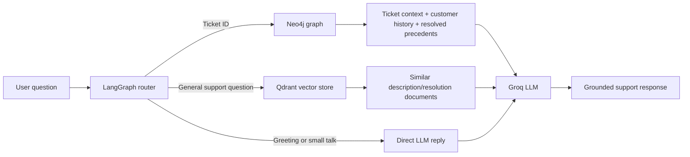

# GraphRAG Support Engine

A graph-enhanced customer support escalation assistant. The engine combines structured ticket relationships in Neo4j, semantic search over ticket text in Qdrant, and Groq-hosted LLM generation behind a LangGraph router.

It is designed to answer questions such as:

- What is happening with ticket `123`?
- Has this customer had similar issues before?
- How were similar issues resolved?
- How are refund or technical issues typically handled?

## Architecture



The router classifies each question as one of:

- `TICKET_LOOKUP`: extracts a numeric ticket ID and retrieves the full graph state.
- `SEMANTIC_SEARCH`: searches Qdrant for similar past descriptions and resolutions.
- `DIRECT`: handles greetings and small talk with a direct LLM response.

For a ticket lookup, graph retrieval assembles:

1. The ticket and its customer, product, issue type, and channel.
2. Other tickets submitted by the same customer.
3. Closed tickets with resolutions for the same issue type and, when available, product.

## Data model

The source data is a flat CSV. Relationships are derived from categorical columns during ingestion:

```text
(:Customer)-[:SUBMITTED]->(:Ticket)
(:Ticket)-[:ABOUT_PRODUCT]->(:Product)
(:Ticket)-[:CATEGORIZED_AS]->(:IssueType)
(:Ticket)-[:VIA_CHANNEL]->(:Channel)
```

Ticket description and resolution text are indexed separately in Qdrant with metadata identifying the source ticket and text type.

The expected CSV file is `data/customer_support_tickets.csv` with these columns:

```text
Ticket ID
Customer Name
Customer Email
Customer Age
Customer Gender
Product Purchased
Date of Purchase
Ticket Type
Ticket Subject
Ticket Description
Ticket Status
Resolution
Ticket Priority
Ticket Channel
First Response Time
Time to Resolution
Customer Satisfaction Rating
```

## Requirements

- Python 3.10+ recommended
- A reachable Neo4j instance, local or Neo4j Aura
- A Qdrant instance, with URL and API key
- A Groq API key
- Internet access on the first embedding run to download `sentence-transformers/all-MiniLM-L6-v2`

Install the Python dependencies from the repository root:

```powershell
python -m venv .venv
.\.venv\Scripts\Activate.ps1
python -m pip install --upgrade pip
pip install -r requirements.txt
```

On Windows, PowerShell may require an execution-policy adjustment before activating a local virtual environment. Alternatively, run commands with `.venv\Scripts\python.exe` directly.

## Configuration

Create a `.env` file in the repository root. Do not commit it; `.gitignore` already excludes it.

```dotenv
NEO4J_URI=neo4j+s://<your-instance>.databases.neo4j.io
NEO4J_USER=neo4j
NEO4J_PASSWORD=<your-password>

QDRANT_URL=https://<your-qdrant-endpoint>
QDRANT_API_KEY=<your-qdrant-api-key>

GROQ_API_KEY=gsk_<your-groq-api-key>
# Optional; defaults to openai/gpt-oss-20b
GROQ_MODEL=openai/gpt-oss-20b
```

`graph/connection.py` validates the Neo4j connection and tries compatible URI forms, including local `neo4j://localhost:7687` and `bolt://localhost:7687` fallbacks. The Qdrant and Groq values must still be configured explicitly.

## Run the pipeline

Run these commands from the repository root, in order.

### 1. Verify Neo4j

```powershell
python graph/connection.py
```

### 2. Load the graph

```powershell
python ingestion/load_graph.py
```

This creates uniqueness constraints and loads customers, tickets, products, issue types, channels, and their relationships. The loader is idempotent for the nodes and relationships it creates because it uses Neo4j `MERGE`.

### 3. Build the Qdrant index

```powershell
python ingestion/load_vectors.py
```

This creates or reuses the `support-ticket-text` collection, embeds non-empty ticket descriptions and resolutions with `sentence-transformers/all-MiniLM-L6-v2`, and uploads them to Qdrant. The embedding dimension is configured as 384.

### 4. Test graph retrieval or generation

```powershell
python graph/retriever.py
python retrieval/generate.py
```

Both commands select a ticket from the graph automatically. The generation command uses the assembled graph state as the only context for the resolution prompt.

### 5. Run the interactive router

```powershell
python router/graph_router.py
```

Enter questions at the `You:` prompt. Type `quit` or `exit` to stop.

## Web application

Start the FastAPI server from the repository root:

```powershell
uvicorn webapp.server:app --reload
```

Open [http://127.0.0.1:8000](http://127.0.0.1:8000). The UI provides a chat panel and a live SVG traversal view. The backend endpoint is:

```text
POST /api/chat
Content-Type: application/json

{"question": "What is happening with ticket 123?"}
```

The response contains:

```json
{
  "answer": "...",
  "route": "TICKET_LOOKUP",
  "trace": {
    "nodes": [],
    "edges": []
  }
}
```

The trace is populated for ticket lookups and contains the customer, ticket, product, issue type, customer history, and resolved precedent nodes when available.

## Evaluation

The evaluation uses closed tickets with non-empty historical resolutions as real reference answers.

First generate the deterministic 20-case sample, or all available cases when fewer than 20 qualify:

```powershell
python eval/build_golden_dataset.py
```

Then run retrieval, generation, faithfulness, and resolution-alignment checks:

```powershell
python eval/eval.py
```

The evaluation reports:

- Retrieval hit rate: whether the ticket was found in Neo4j.
- Generation faithfulness: an LLM judge checks whether the answer is supported by the retrieved graph state.
- Resolution alignment: an LLM judge compares the generated response with the actual historical resolution.

These checks require working Neo4j and Groq credentials. The golden dataset is stored in `eval/golden_dataset.json`.

## Repository guide

| Path | Purpose |
| --- | --- |
| `data/customer_support_tickets.csv` | Source customer-support ticket dataset. |
| `docs/DATASET_DOCS.md` | Dataset source, rationale, limitations, and graph schema notes. |
| `docs/DESIGN_DOC.md` | Design-document outline for architecture, tradeoffs, evaluation, and production considerations. |
| `graph/connection.py` | Shared Neo4j driver creation and connection verification. |
| `graph/retriever.py` | Multi-hop ticket, customer-history, and resolved-precedent retrieval. |
| `ingestion/ingest.py` | Small Hugging Face `datasets` CSV-loading smoke test. |
| `ingestion/load_graph.py` | CSV-to-Neo4j graph ingestion. |
| `ingestion/load_vectors.py` | Description/resolution embedding and Qdrant ingestion. |
| `retrieval/vector_search.py` | Similarity search over the Qdrant collection. |
| `retrieval/generate.py` | Grounded resolution prompt and Groq LLM integration. |
| `router/graph_router.py` | LangGraph classification and routing workflow. |
| `eval/build_golden_dataset.py` | Reproducible golden-set generation. |
| `eval/eval.py` | End-to-end retrieval and LLM-as-judge evaluation. |
| `webapp/server.py` | FastAPI API and graph-trace construction. |
| `webapp/static/index.html` | Web application markup. |
| `webapp/static/app.js` | Chat requests, typing effect, and graph animation. |
| `webapp/static/style.css` | Web application styling and responsive layout. |
| `visualisation-1.png` | Repository visualization artifact. |
| `requirements.txt` | Python dependencies. |

## Limitations and production considerations

- The graph is derived from one flat CSV; it does not represent native foreign-key relationships.
- Ticket IDs are extracted from questions with a simple numeric regex, so ambiguous numbers may be interpreted as ticket IDs.
- Semantic search returns text documents directly and does not currently hydrate each result with its complete graph context.
- The router creates LLM clients and database/vector connections during request paths; production deployments should add pooling, timeouts, retries, and observability.
- Faithfulness and alignment are evaluated by an LLM judge, so evaluation results are useful signals rather than deterministic guarantees.
- The local embedding model runs on CPU by default.
